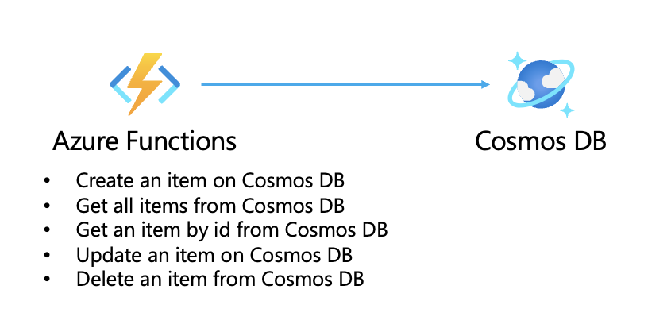

# Java on Azure Functions

This respository demonstrates how to deploy Java applications on Azure Functions.

## Background

This guide describes how to get started with developing Java applications on Azure Functions. In the guide it is assumed that you will be using Java to deploy applications to Azure Functions.

The repo at present contains code and details for the following:

- Create an item on Cosmos DB
- Get all items from Cosmos DB
- Get an item by id from Cosmos DB
- Update an item on Cosmos DB
- Delete an item from Cosmos DB

## Prerequisites

1. Azure Active Directory Tenant.
2. Minimum 1 subscription, for when deploying applications. If you don't have an Azure subscription, create a [free account](https://azure.microsoft.com/en-us/free/?ref=microsoft.com&utm_source=microsoft.com&utm_medium=docs&utm_campaign=visualstudio) before you begin.

## Getting started

- Fork this repo to your own GitHub organization, you should not create a direct clone of the repo. Pull requests based off direct clones of the repo will not be allowed.
- Clone the repo from your own GitHub organization to your developer workstation.
- Review your current configuration to determine what scenario applies to you. We have guidance that will help deploy Azure Functions in your subscription.

### How to deploy applications to Azure Functions

In this section, you will deploy this architecture.



First, you have to create Cosmos DB to store items. Any `database id` and `container id` is ok, but `partition key` must be **/id** in this demo.

Then, you have to create `local.settings.json` in the root directory. When creating `local.settings.json`, you can refer to `local.settings.sample.json`.

The `local.settings.json` should have the following values, which can be copied from Azure portal.

| key                            | description                   |
| :----------------------------- | :---------------------------- |
| `COSMOSDB_ENDPOINT`            | Cosmos DB endpoint.           |
| `COSMOSDB_KEY`                 | The key of Cosmos DB.         |
| `ItemDatabaseConnectionString` | Cosmos DB connection strings. |

After that, you can execute this function locally, running this command.

```bash
mvn clean package
mvn azure-functions:run
```

Finally, you can deploy functions to Azure. Completing deployment, you have to [set environment variables on Azure Functions](https://learn.microsoft.com/en-us/azure/azure-functions/functions-app-settings).

```bash
az login
mvn azure-functions:deploy
```

## Considerations

- This demo depends on the public ip address attached to Cosmos DB. If database should be in private, you should use private endpoint.
